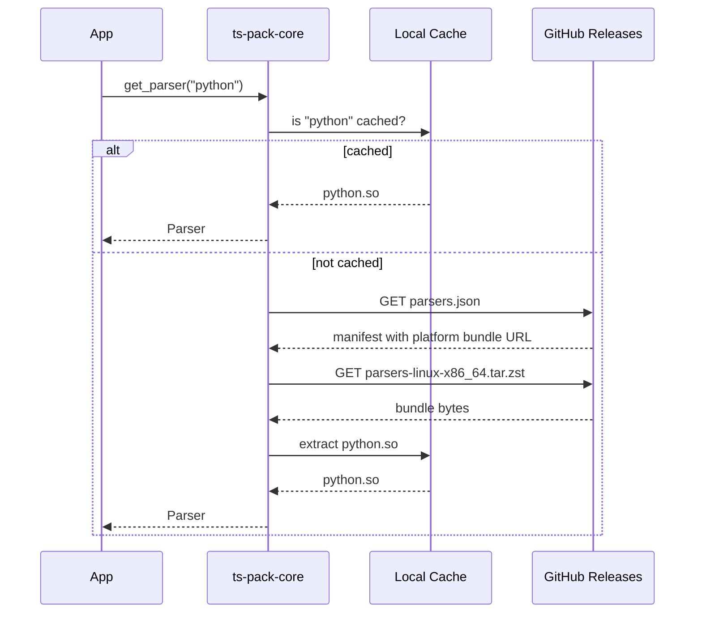

import { Tabs, TabItem } from "@astrojs/starlight/components";
import { Content as Snip_python_configure_cache_dir } from "../../../snippets/generated/python/download/download_configure_custom_dir.md";
import { Content as Snip_typescript_configure_cache_dir } from "../../../snippets/generated/typescript/download/download_configure_custom_dir.md";
import { Content as Snip_rust_configure_cache_dir } from "../../../snippets/generated/rust/download/download_configure_custom_dir.md";
import { Content as Snip_python_download_multiple } from "../../../snippets/generated/python/download/download_multiple_languages.md";
import { Content as Snip_typescript_download_multiple } from "../../../snippets/generated/typescript/download/download_multiple_languages.md";
import { Content as Snip_rust_download_multiple } from "../../../snippets/generated/rust/download/download_multiple_languages.md";

{/* Alef-generated corpus: docs-site/src/snippets/generated/`language`/download/`fixture-id`.md */}

Native tree-sitter-language-pack runtimes fetch parsers on first use and cache them locally. This keeps install sizes small and gives you control over which languages are available.

The WebAssembly package is different: it ships a curated static subset of parsers inside the `.wasm` module and does not expose native download/cache helpers.

---

## How It Works



The flow in detail:

1. Your code calls `get_parser("python")` (or `get_language`, or `process`).
2. The core checks the local cache directory for the parser binary.
3. If not cached, it fetches `parsers.json` from GitHub releases to find the correct download URL for the current platform.
4. The binary downloads and writes to the cache directory.
5. The process opens the binary via `dlopen` / `LoadLibrary` and resolves the parser symbol.
6. On later calls, the cached binary serves directly — no network access.

---

## Cache Directory

Parser libraries live under `<cache>/tree-sitter-language-pack/v{version}/libs`, where
`{version}` is the package version — so upgrading the package starts from a clean parser
set rather than reusing binaries built for an older release. The platform-specific
`<cache>` base:

| Platform | `<cache>` base                          | Resulting parser directory                                        |
| -------- | --------------------------------------- | ----------------------------------------------------------------- |
| Linux    | `$XDG_CACHE_HOME` or `~/.cache`         | `~/.cache/tree-sitter-language-pack/v1.14.3/libs`                 |
| macOS    | `~/Library/Caches`                      | `~/Library/Caches/tree-sitter-language-pack/v1.14.3/libs`         |
| Windows  | `%LOCALAPPDATA%`                        | `%LOCALAPPDATA%\tree-sitter-language-pack\v1.14.3\libs`           |

The cache directory must be owned by the current process's uid or by root, and must not be group- or other-writable — the load path `dlopen`s libraries from it, so a directory any other local user can write is refused. Root ownership is accepted deliberately: a read-only container image can bake the cache as root at build time and run as a non-root uid, since only root can write to it. See [Configuration § Cache ownership](/guides/configuration/#cache-ownership).

You can override it programmatically:

<Tabs syncKey="lang">
<TabItem label="Python">

<Snip_python_configure_cache_dir />

</TabItem>
<TabItem label="Node.js">

<Snip_typescript_configure_cache_dir />

</TabItem>
<TabItem label="Rust">

<Snip_rust_configure_cache_dir />

</TabItem>
<TabItem label="CLI">

```bash
ts-pack cache-dir           # show current cache dir
```

</TabItem>
</Tabs>

---

## Parser Manifest

The manifest is a JSON file (`parsers.json`) hosted on each GitHub release. It has one bundle per platform (each bundle contains every grammar for that target), plus per-language metadata and group definitions:

Platform keys are `{os}-{arch}`, where `os` is `linux`, `macos`, or `windows` and `arch` is
the Rust target arch name (`x86_64`, `aarch64`) — except on macOS, where `aarch64` is spelled
`arm64`.

```json
{
  "version": "1.14.3",
  "platforms": {
    "linux-x86_64": {
      "url": "https://github.com/.../parsers-linux-x86_64.tar.zst",
      "sha256": "…",
      "size": 12345678
    },
    "linux-aarch64": {
      "url": "https://github.com/.../parsers-linux-aarch64.tar.zst",
      "sha256": "…",
      "size": 12345678
    },
    "macos-x86_64": {
      "url": "https://github.com/.../parsers-macos-x86_64.tar.zst",
      "sha256": "…",
      "size": 12345678
    },
    "macos-arm64": {
      "url": "https://github.com/.../parsers-macos-arm64.tar.zst",
      "sha256": "…",
      "size": 12345678
    },
    "windows-x86_64": {
      "url": "https://github.com/.../parsers-windows-x86_64.zip",
      "sha256": "…",
      "size": 12345678
    }
  },
  "languages": {
    "python": { "group": "all", "size": 524288 },
    "rust": { "group": "all", "size": 786432 },
    "javascript": { "group": "all", "size": 458752 }
  },
  "groups": {
    "all": ["python", "rust", "javascript", "..."]
  }
}
```

The manifest caches locally alongside the parser binaries and refreshes on version upgrades. See `ParserManifest` in `crates/ts-pack-core/src/download.rs` for the authoritative schema.

:::caution[`all` is the only group the manifest defines]
Group names are manifest data, not a constant of any binding. The published manifest emits a
single group, `"all"`. Earlier revisions of this page advertised `web`, `systems`, and
`scripting`, which the manifest has never contained — `download_group("web")` fails. Call
`manifest_groups()` to enumerate the names that actually exist.
:::

---

## Pre-Downloading Parsers

For production, CI, or offline environments, download parsers explicitly rather than relying on auto-download at runtime.

<Tabs syncKey="lang">
<TabItem label="Python">

<Snip_python_download_multiple />

</TabItem>
<TabItem label="Node.js">

<Snip_typescript_download_multiple />

</TabItem>
<TabItem label="Rust">

<Snip_rust_download_multiple />

</TabItem>
<TabItem label="CLI">

```bash
# Download specific parsers
ts-pack download python javascript typescript rust

# Download all parsers
ts-pack download --all

# Check what's downloaded
ts-pack list --downloaded
```

</TabItem>
</Tabs>

---

## Inspecting the Cache

<Tabs syncKey="lang">
<TabItem label="Python">

```python
from tree_sitter_language_pack import downloaded_languages, cache_dir, manifest_languages

# Languages available locally (no network needed)
local = downloaded_languages()
print(f"{len(local)} parsers cached at {cache_dir()}")

# All languages in the remote manifest
remote = manifest_languages()
missing = set(remote) - set(local)
print(f"{len(missing)} not yet downloaded")
```

</TabItem>
<TabItem label="CLI">

```bash
# Show cache directory path
ts-pack cache-dir

# List downloaded parsers
ts-pack list --downloaded

# List all available (remote manifest)
ts-pack list --manifest
```

</TabItem>
</Tabs>

---

## Cleaning the Cache

<Tabs syncKey="lang">
<TabItem label="Python">

```python
from tree_sitter_language_pack import clean_cache

clean_cache()  # removes all cached parsers
```

</TabItem>
<TabItem label="CLI">

```bash
ts-pack clean          # remove all cached parsers (prompts for confirmation)
ts-pack clean --force  # skip confirmation prompt
```

</TabItem>
</Tabs>

---

## Docker and CI

For containerized deployments, pre-download parsers during the build stage to remove network access at runtime.

```dockerfile title="Dockerfile"
FROM python:3.12-slim

RUN pip install tree-sitter-language-pack

# Pre-download the parsers your application uses
RUN python -c "from tree_sitter_language_pack import download; download(['python', 'javascript', 'rust'])"

COPY . /app
WORKDIR /app
CMD ["python", "app.py"]
```

For CI pipelines, cache the parser directory between runs:

```yaml title="GitHub Actions"
- name: Cache tree-sitter parsers
  uses: actions/cache@v4
  with:
    path: ~/.cache/tree-sitter-language-pack
    key: tslp-parsers-${{ hashFiles('requirements.txt') }}
```

---

## Configuration File

For projects that always use the same set of languages, create a `language-pack.toml` in the project root:

```toml title="language-pack.toml"
languages = ["python", "javascript", "typescript", "rust", "go"]
cache_dir = ".cache/parsers"   # optional: project-local cache
```

Then download everything declared:

<Tabs syncKey="lang">
<TabItem label="CLI">

```bash
ts-pack init --languages python,javascript,typescript,rust,go
ts-pack download   # downloads all configured languages
```

</TabItem>
<TabItem label="Python">

```python
from tree_sitter_language_pack import init

# Reads language-pack.toml from current directory
init()
```

</TabItem>
</Tabs>

See [Configuration](/guides/configuration/) for the full file format and discovery rules.
