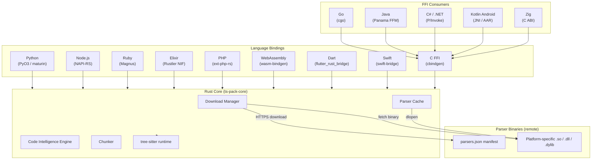

Tree-sitter-language-pack follows a layered architecture: a single Rust core library handles all parsing logic, and thin binding layers expose that API natively in each target language. No business logic lives in the bindings — they are pure translation layers.

---

## High-Level Diagram



---

## Rust Core

All logic lives in a single crate: `crates/ts-pack-core`.

| Component                    | Responsibility                                                                                                              |
| ---------------------------- | --------------------------------------------------------------------------------------------------------------------------- |
| **Download Manager**         | Resolves the remote manifest, fetches platform-specific parser binaries, stores them in the local cache.                    |
| **Parser Cache**             | Maps language names to loaded `tree_sitter::Language` values. Once loaded, a parser is reused without re-reading from disk. |
| **Code Intelligence Engine** | Walks parsed ASTs to extract structure, imports, exports, symbols, comments, docstrings, data trees, diagnostics, and chunks. |
| **Chunker**                  | Walks the syntax tree and splits source code at natural boundaries, respecting a configurable token budget.                 |

The core has no language-specific code. It calls tree-sitter through its stable C ABI using dynamically loaded parser binaries.

---

## Binding Layer

Each binding is a thin crate that:

1. Calls Rust core functions.
2. Converts Rust types to the target language's native types (`String` → `str`, `Vec<T>` → list/array, `Result<T, E>` → exception/error).
3. Exposes an idiomatic API matching the target language's conventions.

Binding crates contain no parsing logic, no query definitions, and no chunking code.

| Location                   | Framework        | Distribution         |
| -------------------------- | ---------------- | -------------------- |
| `crates/ts-pack-core-py`   | PyO3 + maturin   | PyPI wheels          |
| `crates/ts-pack-core-node` | NAPI-RS          | npm (multi-platform) |
| `packages/ruby`            | Magnus           | RubyGems native gem  |
| `packages/elixir`          | Rustler NIF      | Hex.pm               |
| `crates/ts-pack-core-php`  | ext-php-rs       | Packagist            |
| `crates/ts-pack-core-wasm` | wasm-bindgen     | npm (Wasm)           |
| `crates/ts-pack-core-ffi`  | cbindgen (C FFI) | GitHub releases      |
| `packages/go`              | cgo              | Go modules           |
| `packages/java`            | Panama FFM       | Maven Central        |
| `packages/csharp`          | P/Invoke         | NuGet                |
| `packages/dart`            | flutter_rust_bridge | pub.dev           |
| `packages/kotlin-android`  | JNI / Android AAR | Maven Central       |
| `packages/swift`           | swift-bridge     | SwiftPM              |
| `packages/zig`             | C ABI wrapper    | Zig package          |

---

## Parser Binaries

Native packages do not compile the full parser set into the package. Instead:

1. A `parsers.json` manifest (on GitHub releases) lists one bundle per target platform plus per-language metadata for all 306 grammars.
2. On first use, the matching platform bundle downloads and extracts to the local cache directory.
3. The runtime opens the relevant grammar binary via `dlopen` / `LoadLibrary` and resolves the `tree_sitter_<language>` symbol.

This keeps installation fast and download sizes minimal. See [Download Model](download-model.md) for the full detail.

The WebAssembly package is the exception: it uses a curated static parser subset compiled into the `.wasm` module and does not expose native download/cache helpers.

---

## ABI Compatibility

All 306 bundled grammars are compiled at tree-sitter **ABI version 14**, with one exception: Perl uses ABI 15 (no upstream ABI 14 grammar available).

ABI 14 is accepted by tree-sitter runtimes spanning versions 0.21 through 0.26, and by the following host tree-sitter packages (used via host-native Language passthrough):

- **Python**: `tree-sitter` >=0.23
- **Node.js**: `tree-sitter` latest (matches node-tree-sitter's embedded tree-sitter version)
- **Go**: `go-tree-sitter` v0.24.0+
- **Java**: `jtreesitter` 0.26.0+
- **C#**: `TreeSitter.DotNet` 1.3.0+
- **Kotlin/Android**: `ktreesitter` 0.25.0+
- **Swift**: `SwiftTreeSitter` 0.25.0+
- **Zig**: `zig-tree-sitter` v0.26.0+
- **C**: `libtree-sitter` (any ABI 14-compatible runtime; `get_language()` returns the bare `const TSLanguage *`)

This wide compatibility window ensures the language pack works across a broad ecosystem of tree-sitter consumers without requiring version pinning or ecosystem-specific grammar patches.

---

## Repository Layout

```text
tree-sitter-language-pack/
├── crates/
│   ├── ts-pack-core/       # Rust core library
│   ├── ts-pack-cli/        # CLI binary
│   ├── ts-pack-core-py/    # Python (PyO3) binding
│   ├── ts-pack-core-node/  # Node.js (NAPI-RS) binding
│   ├── ts-pack-core-php/   # PHP (ext-php-rs) extension
│   ├── ts-pack-core-wasm/  # WebAssembly (wasm-bindgen) binding
│   └── ts-pack-core-ffi/   # C FFI for native-package consumers
├── packages/
│   ├── python/             # Python package wrapper
│   ├── typescript/         # TypeScript / Node.js package
│   ├── ruby/               # Ruby gem (Magnus NIF)
│   ├── elixir/             # Elixir package (Rustler NIF)
│   ├── php/                # PHP Composer package
│   ├── go/                 # Go module (cgo wrapper)
│   ├── java/               # Java package (Panama FFM)
│   ├── csharp/             # C# / .NET package (P/Invoke)
│   ├── dart/               # Dart / Flutter package
│   ├── kotlin-android/     # Android AAR package
│   ├── swift/              # SwiftPM package
│   ├── zig/                # Zig package
│   └── wasm/               # WebAssembly npm package
├── sources/
│   └── language_definitions.json  # Grammar source registry
└── scripts/
    └── generate_readme.py  # README sync tooling
```

Documentation snippets under `docs/snippets/` are discovered, validated, and
audited by `alef snippets` (see `task docs:snippets:check`). The legacy
`tools/snippet-runner` Rust crate was retired in favour of this shared
capability.

---

## Design Principles

- **Single source of truth** — All parsing and intelligence logic lives in `ts-pack-core`. Binding crates are pure glue.
- **On-demand downloads** — Parsers do not ship in the package. The pack fetches and caches them per-platform on first use.
- **ABI stability** — The C FFI layer (`ts-pack-core-ffi`) follows strict semantic versioning. Native bindings depend on stable ABI handles, not Rust internals.
- **Zero duplication** — Parser loading, chunking strategies, and intelligence extraction are each written once in Rust and reused across all generated language surfaces.
