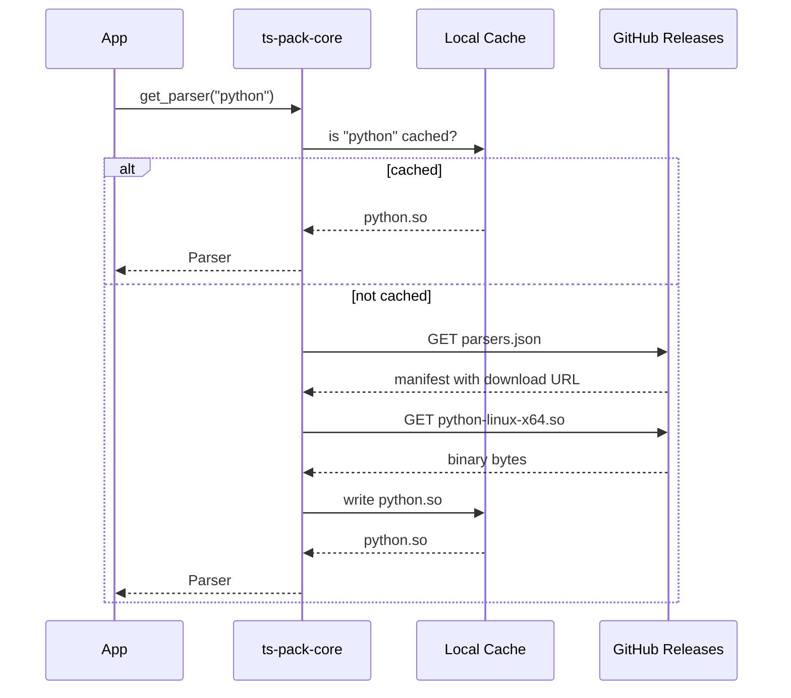

Native tree-sitter-language-pack runtimes fetch parsers on first use and cache them locally. This keeps install sizes small and gives you control over which languages are available.

The WebAssembly package is different: it ships a curated static subset of parsers inside the `.wasm` module and does not expose native download/cache helpers.

---

## How It Works



The flow in detail:

1. Your code calls `get_parser("python")` (or `get_language`, or `process`).
2. The core checks the local cache directory for the parser binary.
3. If not cached, it fetches `parsers.json` from GitHub releases to find the correct download URL for the current platform.
4. The binary downloads and writes to the cache directory.
5. The process opens the binary via `dlopen` / `LoadLibrary` and resolves the parser symbol.
6. On later calls, the cached binary serves directly — no network access.

---

## Cache Directory

The default cache location is platform-specific:

| Platform | Default Path                                                                        |
| -------- | ----------------------------------------------------------------------------------- |
| Linux    | `$XDG_CACHE_HOME/tree-sitter-language-pack` or `~/.cache/tree-sitter-language-pack` |
| macOS    | `~/Library/Caches/tree-sitter-language-pack`                                        |
| Windows  | `%LOCALAPPDATA%\tree-sitter-language-pack`                                          |

You can override it programmatically:

=== "Python"

    ```python
    from tree_sitter_language_pack import configure, PackConfig

    configure(PackConfig(cache_dir="/custom/path"))
    ```

=== "Node.js"

    ```typescript
    import { configure } from "@xberg-io/tree-sitter-language-pack";

    configure({ cacheDir: "/custom/path" });
    ```

=== "Rust"

    ```rust
    use tree_sitter_language_pack::{configure, PackConfig};

    configure(PackConfig { cache_dir: Some("/custom/path".into()), ..Default::default() })?;
    ```

=== "CLI"

    ```bash
    ts-pack cache-dir           # show current cache dir
    ```

---

## Parser Manifest

The manifest is a JSON file (`parsers.json`) hosted on each GitHub release. It has one bundle per platform (each bundle contains every grammar for that target), plus per-language metadata and group definitions:

```json
{
  "version": "1.9.0-rc.49",
  "platforms": {
    "linux-x64": {
      "url": "https://github.com/.../parsers-linux-x64.tar.zst",
      "sha256": "…",
      "size": 12345678
    },
    "linux-arm64": {
      "url": "https://github.com/.../parsers-linux-arm64.tar.zst",
      "sha256": "…",
      "size": 12345678
    },
    "macos-x64": {
      "url": "https://github.com/.../parsers-macos-x64.tar.zst",
      "sha256": "…",
      "size": 12345678
    },
    "macos-arm64": {
      "url": "https://github.com/.../parsers-macos-arm64.tar.zst",
      "sha256": "…",
      "size": 12345678
    },
    "windows-x64": {
      "url": "https://github.com/.../parsers-windows-x64.zip",
      "sha256": "…",
      "size": 12345678
    }
  },
  "languages": {
    "python": { "group": "scripting", "size": 524288 },
    "rust": { "group": "systems", "size": 786432 },
    "javascript": { "group": "web", "size": 458752 }
  },
  "groups": {
    "scripting": ["python", "ruby", "lua", "perl", "..."],
    "systems": ["rust", "c", "cpp", "go", "..."],
    "web": ["javascript", "typescript", "html", "css", "..."]
  }
}
```

The manifest caches locally alongside the parser binaries and refreshes on version upgrades. See `ParserManifest` in `crates/ts-pack-core/src/download.rs` for the authoritative schema.

---

## Pre-Downloading Parsers

For production, CI, or offline environments, download parsers explicitly rather than relying on auto-download at runtime.

=== "Python"

    ```python
    from tree_sitter_language_pack import download, download_all, init

    # Download specific languages
    download(["python", "javascript", "typescript", "rust"])

    # Download all 306 parsers
    download_all()

    # Configure + download in one call
    init(["python", "javascript"])
    ```

=== "Node.js"

    ```typescript
    import { download, downloadAll, init } from "@xberg-io/tree-sitter-language-pack";

    // Download specific languages
    await download(["python", "javascript", "typescript", "rust"]);

    // Download everything
    await downloadAll();

    // Configure + download in one call
    await init(["python", "javascript"]);
    ```

=== "Rust"

    ```rust
    use tree_sitter_language_pack::{download, download_all, init};

    // Download specific languages
    download(&["python", "javascript", "rust"])?;

    // Download everything
    download_all()?;

    // Configure + download in one call
    init(&["python", "javascript"])?;
    ```

=== "CLI"

    ```bash
    # Download specific parsers
    ts-pack download python javascript typescript rust

    # Download all parsers
    ts-pack download --all

    # Check what's downloaded
    ts-pack list --downloaded
    ```

---

## Inspecting the Cache

=== "Python"

    ```python
    from tree_sitter_language_pack import downloaded_languages, cache_dir, manifest_languages

    # Languages available locally (no network needed)
    local = downloaded_languages()
    print(f"{len(local)} parsers cached at {cache_dir()}")

    # All languages in the remote manifest
    remote = manifest_languages()
    missing = set(remote) - set(local)
    print(f"{len(missing)} not yet downloaded")
    ```

=== "CLI"

    ```bash
    # Show cache directory path
    ts-pack cache-dir

    # List downloaded parsers
    ts-pack list --downloaded

    # List all available (remote manifest)
    ts-pack list --manifest
    ```

---

## Cleaning the Cache

=== "Python"

    ```python
    from tree_sitter_language_pack import clean_cache

    clean_cache()  # removes all cached parsers
    ```

=== "CLI"

    ```bash
    ts-pack clean          # remove all cached parsers (prompts for confirmation)
    ts-pack clean --force  # skip confirmation prompt
    ```

---

## Docker and CI

For containerized deployments, pre-download parsers during the build stage to remove network access at runtime.

```dockerfile title="Dockerfile"
FROM python:3.12-slim

RUN pip install tree-sitter-language-pack

# Pre-download the parsers your application uses
RUN python -c "from tree_sitter_language_pack import download; download(['python', 'javascript', 'rust'])"

COPY . /app
WORKDIR /app
CMD ["python", "app.py"]
```

For CI pipelines, cache the parser directory between runs:

```yaml title="GitHub Actions"
- name: Cache tree-sitter parsers
  uses: actions/cache@v4
  with:
    path: ~/.cache/tree-sitter-language-pack
    key: tslp-parsers-${{ hashFiles('requirements.txt') }}
```

---

## Configuration File

For projects that always use the same set of languages, create a `language-pack.toml` in the project root:

```toml title="language-pack.toml"
languages = ["python", "javascript", "typescript", "rust", "go"]
cache_dir = ".cache/parsers"   # optional: project-local cache
```

Then download everything declared:

=== "CLI"

    ```bash
    ts-pack init --languages python,javascript,typescript,rust,go
    ts-pack download   # downloads all configured languages
    ```

=== "Python"

    ```python
    from tree_sitter_language_pack import init

    # Reads language-pack.toml from current directory
    init()
    ```

See [Configuration](../guides/configuration.md) for the full file format and discovery rules.
